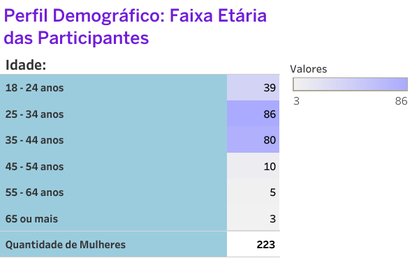
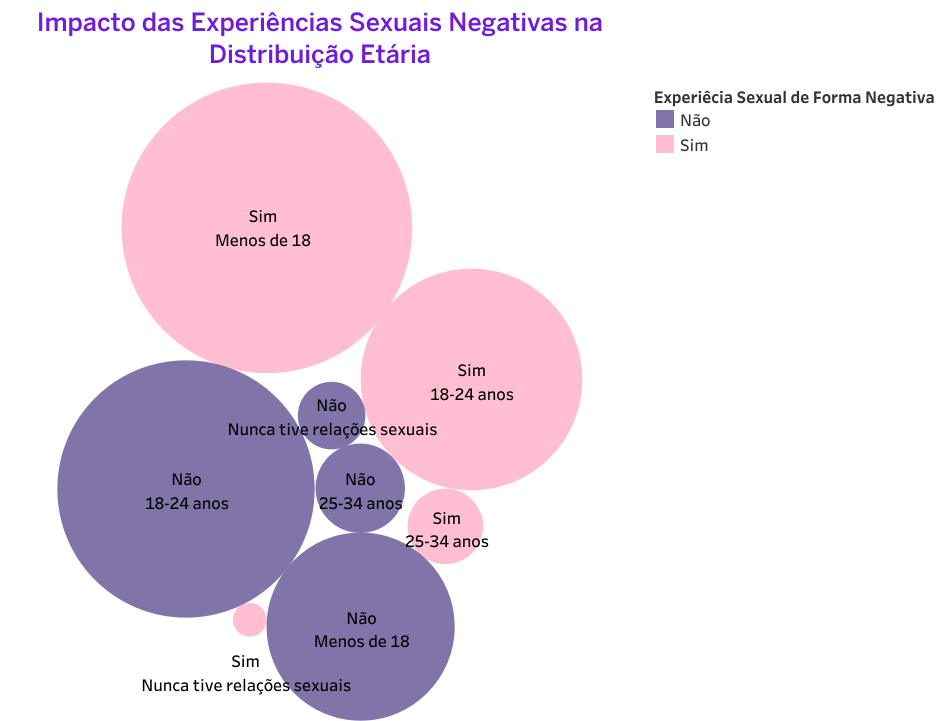
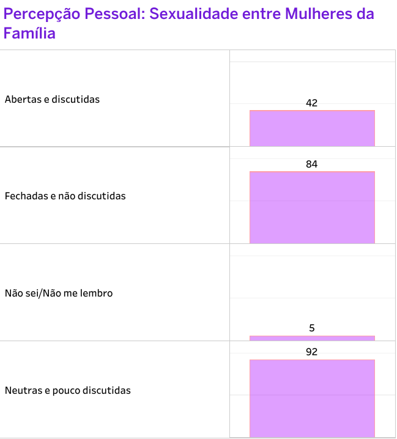
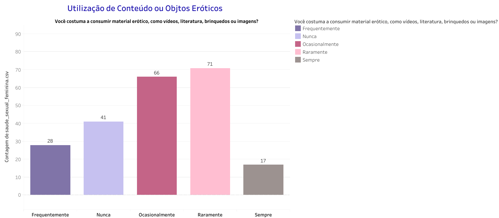
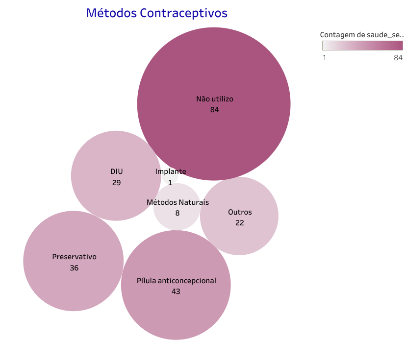
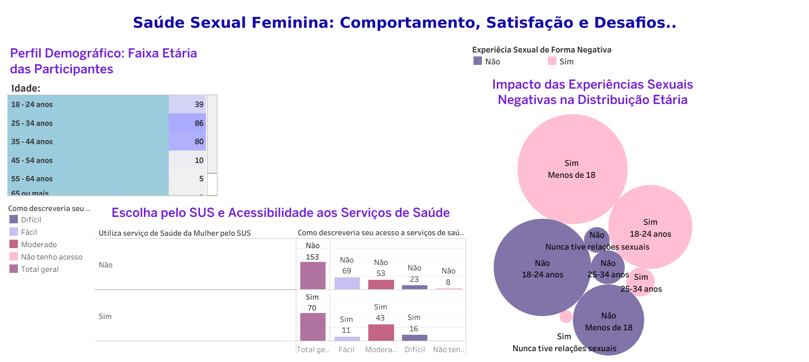
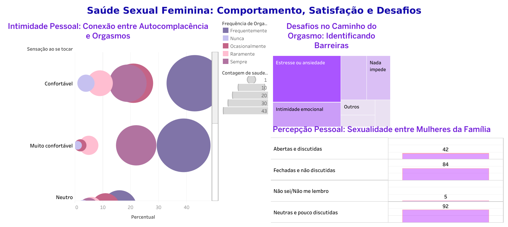
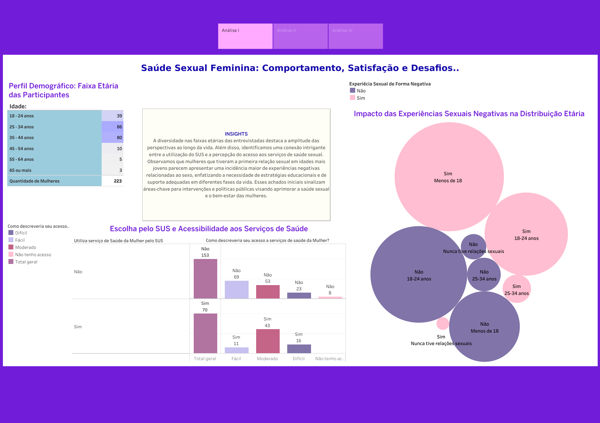
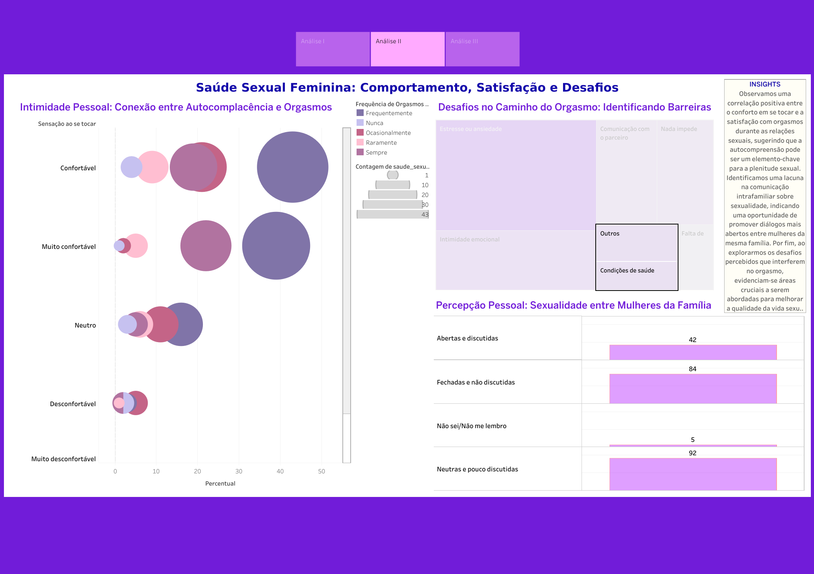
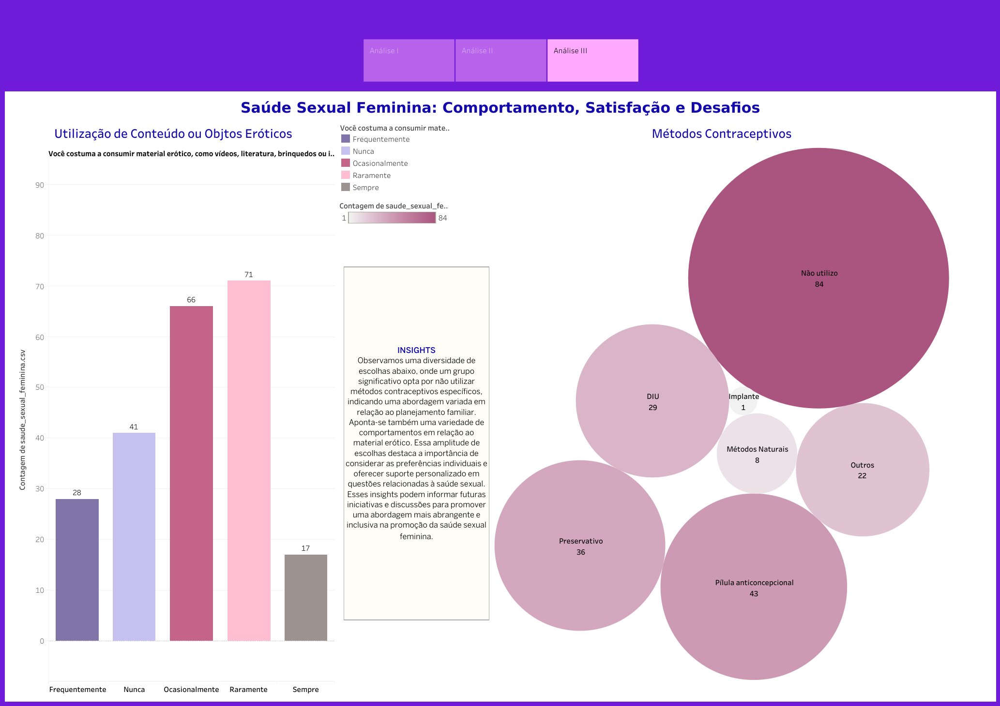

# 🌷**TEMA:** **Saúde Sexual Feminina: Comportamento, Satisfação e Desafios**💜

## 🌷**Base de dados: saude_sexual_feminina** 💜

### A base de dados utilizada neste projeto é originada de uma fonte primária elaborada de própria autoria. A coleta de dados foi realizada por meio de uma pesquisa no Google Forms, abordando a temática principal da saúde sexual feminina. A pesquisa inclui questões que exploram diversos aspectos, como acesso a sáude pública sexual, práticas sexuais, contextos familiares, e outras questões relacionadas ao universo feminino e às questões sexuais.
### Esta abordagem visa fornecer uma visão abrangente e específica sobre a saúde sexual das mulheres, capturando informações relevantes para análises e conclusões no âmbito do estudo.

## 🌷**Desenvolvimento:** 💜

### O conceito de sexualidade tem se modificado ao longo dos anos. Sendo atualmente visto como um dos indicadores de qualidade de vida, parte da saúde e do bem-estar geral, não se restringindo tão somente à meta reprodutiva, passando também a ser um fortalecedor de relações afetivas entre pessoas. A sexualidade feminina, no entanto, ainda carrega questões culturais que de alguma forma podem implicar na prática sexual de algumas mulheres, ainda que em tempos atuais, onde as informações estão mais acessíveis.

## 🌷**Objetivo Geral:** 💜

### O objetivo deste projeto consiste em compreender, através de um questionário, características que podem implicar em uma vida sexual mais saudável ou não na vida de algumas mulheres. Com isso, pretendemos linkar aspectos relacionados à idade, possíveis traumas, métodos contraceptivos, qualidade da vida sexual, rotina entre outras questões que permeiam o universo Feminino.

## 🌷**Objetivos Específicos** 💜

### Explorar a Relação entre o conhecimento do corpo e o prazer;
### Avaliar a Influência de Traumas na Vida Sexual e a iniciação da vida sexual;
### Diálogo sobre sexo entre mulheres na família;
### Analise da utilização do Sus e do acessoa a Saúde Feminina;

## 🌷**Feramentas utilizadas:** 💜

 

| Ferramenta | Descrição |
| --- | --- |
| `python` | Linguagem de programação. |
| `pandas`    | Biblioteca criada para a linguagem Python para manipulação e análise de dados.|
| `numpy`    | Biblioteca para a linguagem Python, que suporta o processamento de grandes, multi-dimensionais arranjos e matrizes. |
| `matplotlib`   | Biblioteca de software para criação de gráficos e visualizações de dados em geral, feita para e da linguagem de programação Python.|
| `seaborn`    | Ferramenta para plotagem dos mais variados tipos de gráficos em Python.|
| `jupyter notebook`| Aplicação web criada para desenvolver software de código aberto, padrões abertos e serviços para computação interativa em dezenas de linguagens de programação.|
| `Tableau`    | Plataforma de análise, exploração e gerenciamento de dados visuais.|

## 🌷**Visualização:** 💜

 

### GitHub: https://github.com/danisnegrao/Projet_p1_DaniNegrao

## 🌷**Interface Gráfica:** 💜

# Este projeto está com visualizações públicas no Tableau. Você pode acessar no link [Tableau](https://public.tableau.com/app/profile/daniele.negr.o/viz/Projetofinal_Daninegrao/Histria1?publish=yes).

## 🌷 Autora 💜

 

<a>
 
  
</a>

 Desenvolvido por  

 

